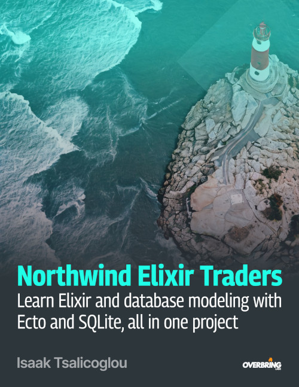

# Northwind Elixir Traders

### Learn Elixir and database modeling with Ecto and SQLite, all in one project

This is the source code of the book by [Isaak Tsalicoglou](https://overbring.com/about). The book (approx. 500 pages) is available for purchase [on Leanpub](https://leanpub.com/northwind-elixir-traders).

## What is "Northwind Elixir Traders"?

This is a book for curious people. Exercise your Elixir skills and learn about working with databases by using Ecto's migrations, changesets, and more to reimagine a classic database that millions around the world have used before for learning. By not pursuing the "happy path", this immersive, exploratory, memorable, project-based tutorial will help you to fearlessly tackle real-world projects with Elixir and Ecto.

> _"This rare gem of a technical book is a must-read for anyone wanting to build practical skills in modeling databases with Elixir and Ecto. But it’s not only about coding—it also emphasizes real-world problem-solving, learning by doing, and tackling development roadblocks head-on with confidence, in a relentless pursuit of understanding. Truly, an invaluable resource for everyone tired of cookie-cutter tutorials and theoretical fluff!"_ -- **Petros Papapanagiotou, PhD / Head of Development**

> _"With this excellent book about modeling data with Ecto and SQLite, I was up and running quickly without snags! I learned how SQLite compares with PostgreSQL and how to work between their differences. Despite Northwind Traders being a toy database, the modeling we do in the book is top notch. After thoroughly modeling the Northwind Traders DB with Ecto, we then craft a gang of queries to glean excellent business "insights" within the data. The author has a strong understanding and passion in this area of development and it shows. Northwind Elixir Traders is an excellent read and a phenomenal Elixir resource."_ -- **Benjamin Gandhi-Shepard, Designer / Developer at Solvm**

Love this book? Found a mistake? Have a request for a next edition? Contact me [on ElixirForum](https://elixirforum.com/u/waseigo), [on LinkedIn](https://www.linkedin.com/in/tisaak/), or [by email](mailto:isaak@overbring.com), or comment on [the book's thread on ElixirForum](https://elixirforum.com/t/northwind-elixir-traders-a-practical-tutorial-on-databases-with-ecto-self-published-leanpub/62622).

### Who is this book for?

[The book](https://leanpub.com/northwind-elixir-traders) has been written for anyone who wants to learn Elixir by practicing on an ambitious project, and anyone who already possesses some Elixir programming skill and basic knowledge of relational databases, and wants to understand Ecto better to a degree that will allow them to model any kind of data with these two technologies.

You will learn about incrementally converting a database schema to Ecto structures and writing the code necessary to manage the data therein, gradually (and retroactively, and iteratively) refining the database model with constraints, changesets and associations and helper functions, and working with dynamic repositories to import, validate and sanitize data, and making queries to generate insights.

### What knowledge is required to get started?

- A basic understanding of Elixir's [`Kernel`](https://hexdocs.pm/elixir/Kernel.html), in particular types of variables, flow control, the [`Enum`](https://hexdocs.pm/elixir/Enum.html) module, how to define modules and functions, and how to write functional pipelines.
- A basic understanding of [relational databases](https://en.wikipedia.org/wiki/Relational_database) and how they are structured (tables, columns and their types, primary and foreign keys).
- Rudimentary skill in [SQL](https://en.wikipedia.org/wiki/SQL) and its syntax.
- Rudimentary skills in running commands in a shell.

### What kind of problems will you learn to solve?

On a high level, you will learn to solve problems such as:

- Thinking through an Entity Relationship Diagram (ERD) and gradually transforming it into Elixir/Ecto code.
- Making decisions about data types when having to deal with existing data that isn't necessarily "clean".
- Dealing with SQLite's limitations that make us stray off the beaten path of Ecto's excellent documentation.
- Automating the importing of data in bulk from another database and verifying its data quality.
- Thinking about real-world boundary conditions when improving a business database like this one.

Especially the latter is informed by my experience in running, digitalizing, and growing a B2B industrial equipment trading business, for which in recent years I have implemented various small pieces of software that are related to the modeling of a database like this one, and much more.

### What else will you learn?

My primary goal for you is to understand how to use Ecto productively. However, through numerous "side-quests" we will exercise Elixir skills that take you _far_ beyond just learning to utilize Ecto. We will use whatever is required to accomplish our objective. This includes [`Enum.reduce/3`](https://hexdocs.pm/elixir/Enum.html#reduce/3) and [`Enum.reduce_while/3`](https://hexdocs.pm/elixir/Enum.html#reduce_while/3), [`use`](https://hexdocs.pm/elixir/Kernel.html#use/2) vs. `import`, basic streams, basic stuff from the [`Application`](https://hexdocs.pm/elixir/Application.html), [`Module`](https://hexdocs.pm/elixir/Module.html), [`Supervisor`](https://hexdocs.pm/elixir/Supervisor.html) and [`Task`](https://hexdocs.pm/elixir/Task.html) modules, and even some parts of Erlang's library, such as the [`httpc`](https://www.erlang.org/doc/apps/inets/httpc.html) HTTP client to make `GET` requests (that we use in this book to fetch CSV data from an online source), or [`timer`](https://www.erlang.org/doc/apps/stdlib/timer.html) for timing the performance of our queries. We will even implement a Depth-First Search algorithm to determine the order in which tables should be imported from the original database. If something could aid us in reaching our goal, we will try it out.

Therefore, my secondary goal for you with this book in terms of Elixir programming skills is to enter with basic knowledge and exit with strengthened skills as a side effect. This includes refactoring code to make everything more composable. Nothing works as well as hands-on practice and repetition for learning, and this book is like an Elixir gym.

My tertiary goal with [Northwind Elixir Traders](https://leanpub.com/northwind-elixir-traders) is to bolster your confidence and expand your research and development skills by helping you acquire an engineer's exploratory mindset and grit in problem-solving. There are numerous references and side discussions and even mini-essays/asides scattered across most chapters that aim to transmit to you some parts of my experience in the R&D of products of different kinds. Therefore, you will also learn about:

- the mentality and tools of working through a complex problem with pragmatism and an eye on managing complexity,
- the gradual implementation of a pedagogical example in a programming language that I absolutely love, and
- the engineer's mindset of dealing fearlessly with obstacles as they arise and aiming to deeply understand what's going on, before rolling up your sleeves to deal with them.

### How is this book different to other books on databases and Ecto?

We will explore the subject matter with a hands-on, outcome-focused approach of gradually modeling an existing pedagogically-mature database schema and by venturing on side-quests to gain a solid understanding of Ecto’s "gotchas" and the ramifications of using Ecto with SQLite instead of the default choice of PostgreSQL.

Different to a book that takes a more "completionist" approach, [Northwind Elixir Traders](https://leanpub.com/northwind-elixir-traders) starts with a specific objective in mind and helps you work towards it by using only the elements of Ecto that are required for the sub-tasks of achieving the objective, without pursuing the coverage of the entirety of Ecto’s functionality as a reference manual. Databases and Ecto, combined, are an immense field of knowledge. If you have basic skills in those topics and want to get some practice in Elixir too, this is the book for you.

This book fosters truly "grokking" Ecto through practice and experimentation, and by exploring why things sometimes don't work as one would expect and diving deep into the documentation to help you figure things out. As such, [Northwind Elixir Traders](https://leanpub.com/northwind-elixir-traders) is the right choice of book for those who prefer applied learning that covers the essentials to get the job done, before diving deeper into every nook and cranny of Ecto with a more comprehensive learning resource or into Ecto's online documentation (which we will be referring to consistently).

### Why SQLite, of all databases out there?

SQLite has been chosen in order to "spice things up" compared to Ecto's out-of-the-box default of using PostgreSQL, thanks to its ever-growing popularity and impressive, far better than just good-enough capabilities for some applications that your might want to build, such as Phoenix APIs or Phoenix LiveView websites with primarily read-heavy functionality. However, the book is written so that your acquired understanding of Ecto is transferable to using any other RDBMS that Ecto has an adapter for. If you want to use PostgreSQL instead of SQLite after finishing this book, you will be well prepared.

### What makes this book special?

[Northwind Elixir Traders](https://leanpub.com/northwind-elixir-traders) _isn't_ your typical Elixir or Ecto tutorial--instead of pursuing the usual "happy path" reflected in its official documentation and "Getting Started" guide, we'll dive into the complexities and nuances of database implementation for business purposes, offering a refreshing exploration that goes beyond the ordinary and the expected.

Our adventure begins by embracing the simplicity of SQLite over the conventional choice of PostgreSQL. This deliberate trade-off in favor of simplicity against feature-completeness introduces challenges and roadblocks that will enrich your learning experience as we navigate the intricacies of schema design, migrations, primary and foreign keys, constraints and validation functions, relational structures between the different tables, importing data from existing databases, and executing queries that return meaningful insights.

Discover the joy of experimentation as we encounter unexpected hurdles and exercise our Elixir skills in figuring out why things don't work as expected, and how to still achieve our goal, regardless. Through these challenges and related "side-quests", you'll gain invaluable insights into problem-solving and critical thinking with Elixir and Ecto. In the process, you will also learn more about the highly versatile and popular SQLite database.

Embrace the engineer's ethos of fearless exploration and systematic problem-solving as we delve deeper into Ecto's capabilities, focusing on the art of reading documentation and adapting to unforeseen obstacles. With each chapter, you'll elevate your understanding of Ecto, empowering yourself to tackle real-world projects with confidence and finesse, instead of with copy-paste operations and "hopes and prayers" that it all works out in the end.

For a curious Elixir newcomer getting into the world of building databases for a microservice, a backend, or a Phoenix or Phoenix LiveView app, [Northwind Elixir Traders](https://leanpub.com/northwind-elixir-traders) confidently promises an immersive learning experience that's both enriching and unforgettable.

## The `NorthwindElixirTraders` Elixir application

All code within [the book](https://leanpub.com/northwind-elixir-traders) and in this repository is licensed under the [Apache-2.0](https://www.apache.org/licenses/LICENSE-2.0) open-source license. You are free to use, modify, and distribute the code, provided that you include proper attribution and comply with the terms of the license.

Other aspects:

- Regarding the patent grants aspects of Apache-2.0: [the book](https://leanpub.com/northwind-elixir-traders) and its git repository does not include patented technology.
- The Apache-2.0 license **does not** extend to the text of the book.

### How to use the codebase

The entirety of [the book](https://leanpub.com/northwind-elixir-traders) has been "replayed" from start to finish (including all IEx snippets), and the Elixir app has been rewritten by following the book. This git repo is the result.

[The book](https://leanpub.com/northwind-elixir-traders) contains hundreds of code snippets that are used to explore Ecto's features in IEx and SQLite's functionality using the `sqlite3` binary. It also contains hundreds of code blocks with titles. Every such code block in the book corresponds to a commit in this git repo, with the title of the block as the commit message. Some commits do not correspond to titled code blocks, but to instructions to make modifications to the code. The are also commits that are unrelated to the book's content, such as changes due to a `mix format`, corrections, etc.

Ideally, you will build the `NorthwindElixirTraders` application from scratch while following [the book](https://leanpub.com/northwind-elixir-traders). The codebase has been published for reference and to make copy-paste easier than from the PDF, as the book has been deliberately written to not pursue the "happy path".
